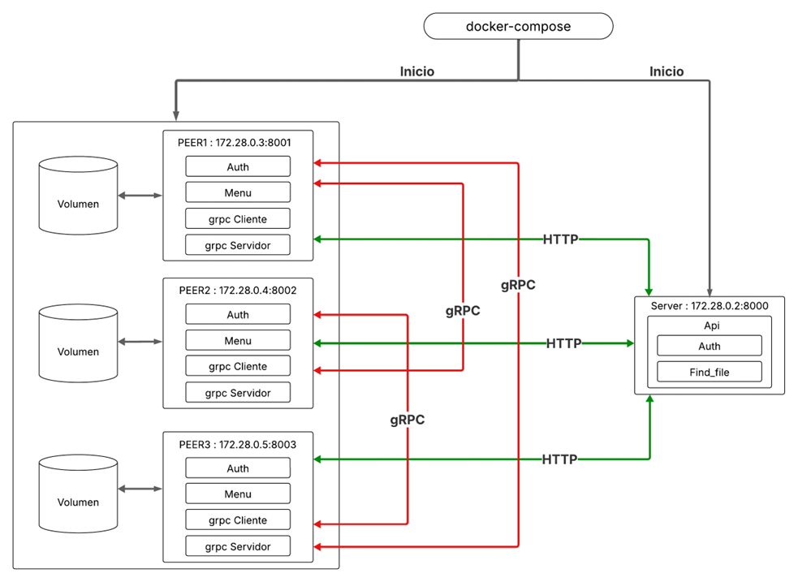

# API REST usando FastAPI para construir una Arquitectura P2P basada en Servidor.

## Integrantes (Desarrolladores)

1. Thomas Camillo Vanegas Acevedo (000287437)
2. Jhon Daniel Gaviria Garcia (000452942)

## Diagrama de Red | Diagrama de Arquitectura



## Requesitos para ejecutar el proyecto.

* Python 3.11+
* [pip](vscode-file://vscode-app/c:/Users/danie/AppData/Local/Programs/Microsoft%20VS%20Code/resources/app/out/vs/code/electron-browser/workbench/workbench.html)
* [Docker](vscode-file://vscode-app/c:/Users/danie/AppData/Local/Programs/Microsoft%20VS%20Code/resources/app/out/vs/code/electron-browser/workbench/workbench.html)
* [Docker Compose](vscode-file://vscode-app/c:/Users/danie/AppData/Local/Programs/Microsoft%20VS%20Code/resources/app/out/vs/code/electron-browser/workbench/workbench.html)

# Intructuivo de Uso

## Como Correr la APi

1. Crea y activa el entorno virtual:

```bash
cd API
python -m venv venv
# En Windows:
venv\Scripts\activate
# En Linux/Mac:
source venv/bin/activate
```

2. Instala las dependencias:

```bash
pip install -r requirements.txt
```

3. Ejecuta el servidor FastApi:

```bash
uvicorn main:app --reload
```

Por defecto, la API estará disponible en http://localhost:8000.

## Como Correr el Peer

1.Crea y activa el entorno virtual:

```bash
cd Peer
python -m venv venv
# En Windows:
venv\Scripts\activate
# En Linux/Mac:
source venv/bin/activate
```

2.Instala las dependencias:

```bash
pip install -r requirements.txt
```

3.Ejecuta el Peer:

```bash
python main.py
```

## Cómo correr todo con Docker Compose

1.Asegúrate de tener el archivo docker-compose.yml en la raíz del proyecto.

2.Construye y levanta los servicios:

```bash
docker-compose up --build
```

Esto levantará tanto la API como los Peers definidos en el archivo docker-compose.yml.

3.Para detener los servicios:

```bash
docker-compose down
```

4.Entra a la consola de algun contenedor:

```bash
docker exec -it p1 bash
```

5.Abre el menu del peer:

```bash
python menu.py
```

## Notas

1. Puedes modificar los puertos y la cantidad de peers en el archivo docker-compose.yml según tus necesidades.

2.Para ver los logs de cada servicio, usa:

```bash
docker-compose logs -f
```

3.Recuerda activar el entorno virtual correspondiente antes de ejecutar comandos de Python o pip en cada carpeta.
